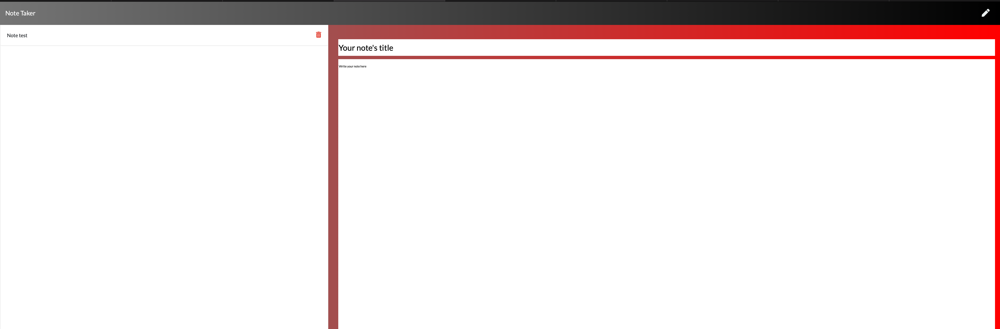

# Note_Taker

[](https://github.com/gidmp/)

[](code_of_conduct.md) 


## Table of Contents 
------

* [Deployed Link](#deployed)

* [Description](#description)

* [Installation](#installation)

* [About](#about)

* [Screenshot](#screenshots)

* [Author](#author)

------

## Deployed link :  https://note-taker-lloret.herokuapp.com

------

## Description


A simple Express.JS based note app that able to take notes and save them and delete eisting notes 

------

## Installation


To install the dependencies, run the following command:

```
npm i express

```

------

## About


This app is a  digital node made with Express.JS. This app is linked with the HTML page to the backend and communicate with a db file, storing all of the saved notes as a JSON.

------

## Screenshots




------

## Author


**Andrea DiBi**

* Github : [Lloret82](https://github.com/lloret82/)

------